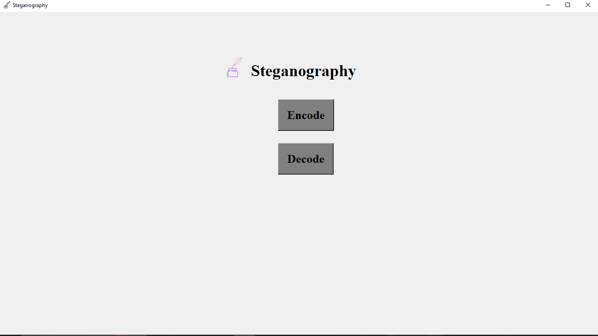
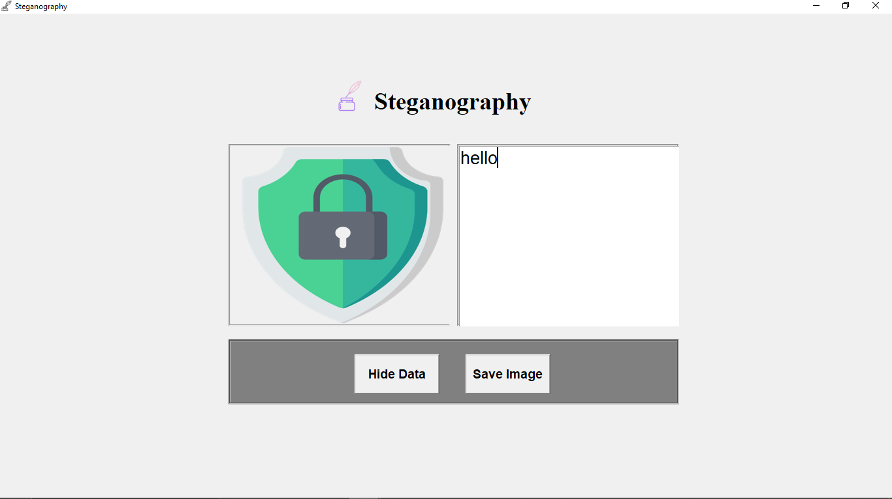
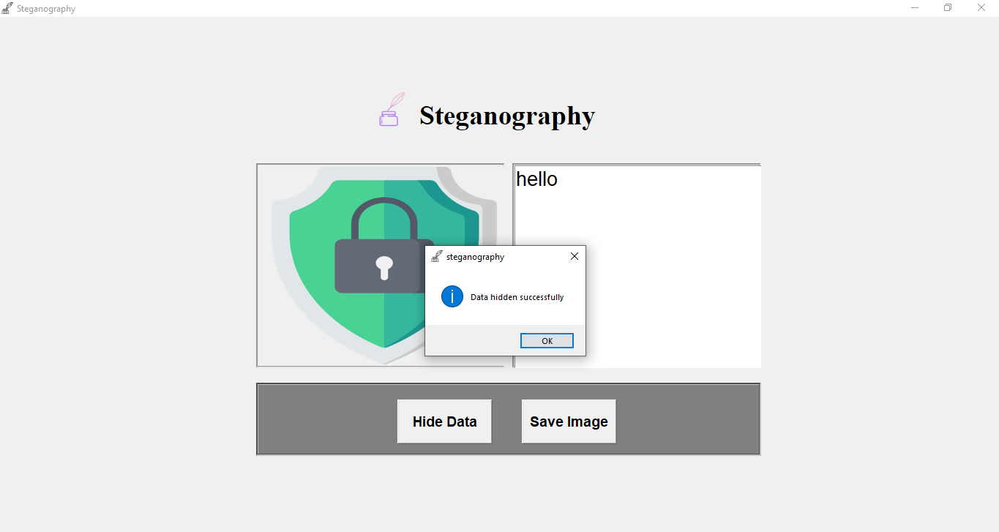
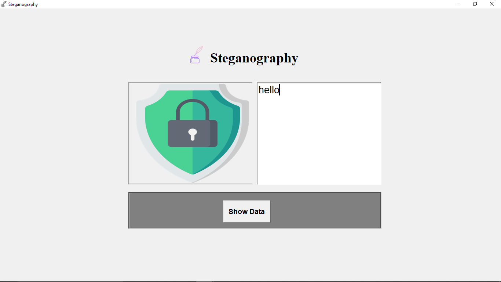

# Image-Stegnography

This project implements basic Image Steganography with two main options: **Encode** and **Decode** images.

---

## Screenshots

### 1. Main Page: Choose Encode or Decode  


### 2. Encode Image Screen  


### 3. Data Hidden Successfully  


### 4. Decode Image Screen  


---

## Usage

- Navigate to the main page (`EncodeOrDecode.png`).
- Select **Encode** to hide secret data inside an image.
- Select **Decode** to extract hidden data from an image.
- Follow on-screen instructions to upload images and enter text data for encoding or decoding.

---

## How to Run

1. Clone the repository
2. Navigate into the project folder:
   ```bash
   cd Image-Stegnography
   ```
3. Run the application:

   ```bash
   python main.py
   ```
4. Use the UI to encode or decode images with hidden data

---

## Notes

- Images and screenshots are stored inside the `assets` folder.
- Ensure your images are supported formats for encoding and decoding.

